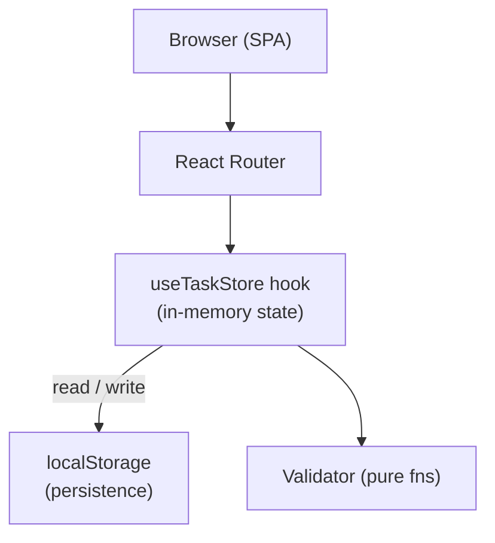

# Design Document — Task Management Website (Frontend-Only)

## Overview

The Task Management Website is a pure client-side single-page application (SPA) built with React and TypeScript. It lets users create, organise, track, and complete tasks entirely in the browser — no account, no login, no server required. All data lives in React state and is synchronised to `localStorage` so tasks survive page refreshes and browser restarts.

Users can group tasks into named lists, set priorities and due dates, and filter or sort their dashboard view. The `Inbox` list is always present as the default home for uncategorised tasks.

### Key Design Goals

1. **Zero backend** — no server, no database, no authentication. The app loads and works offline.
2. **Simplicity** — React state + `localStorage` is the only persistence layer. No external state management library is required.
3. **Responsiveness** — the UI adapts from 320 px to 2560 px viewports using utility-first CSS.
4. **Correctness** — task state transitions and validation rules are enforced inside the React component/hook layer before any state write.

---

## Architecture



### Request Lifecycle (client-only)

1. A user action (form submit, button click) triggers an event handler inside a React component.
2. The handler calls the relevant action from the `useTaskStore` hook.
3. Before any state mutation, the `Validator` module runs synchronous validation and throws/returns an error object on failure.
4. On success, the hook updates in-memory state and writes the new snapshot to `localStorage`.
5. React re-renders the affected components; no page reload is needed.

### Technology Choices

| Layer | Choice | Rationale |
|---|---|---|
| UI framework | React + TypeScript | Component model, strong typing, broad ecosystem |
| Routing | React Router v6 | Declarative client-side routing |
| State | `useReducer` + React Context | Built-in, no extra dependency; sufficient for task-scale data |
| Persistence | `localStorage` JSON serialisation | Zero-dependency, synchronous, survives refresh |
| Styling | Tailwind CSS | Utility-first, mobile-first responsive design |
| Testing | Vitest + React Testing Library + fast-check | Unit/component tests + property-based tests |

---

## Components and Interfaces

### State Store — `useTaskStore`

A custom React hook (backed by `useReducer` + `localStorage` sync) that exposes the following actions:

```typescript
// Task actions
addTask(input: NewTaskInput): Task
updateTask(id: string, patch: Partial<TaskInput>): Task
deleteTask(id: string): void

// Task List actions
addList(name: string): TaskList
renameList(id: string, name: string): TaskList
deleteList(id: string, confirm: boolean): void

// Query helpers
getTasks(filter?: TaskFilter, sort?: TaskSort): Task[]
getListById(id: string): TaskList | undefined
getSummary(): StatusSummary
```

`useTaskStore` is provided at the app root via a `TaskStoreContext` so every component can access state without prop drilling.

### Validator (pure functions)

```typescript
validateTaskTitle(title: string): ValidationResult
validateListName(name: string): ValidationResult
validateDueDate(date: string | undefined): ValidationResult
validateStatus(status: string): ValidationResult
validatePriority(priority: string): ValidationResult
```

`ValidationResult` is `{ ok: true }` or `{ ok: false, message: string }`. Validators are pure functions — no side effects — which makes them trivially testable.

### Frontend Routes

```
/                   → redirect to /dashboard
/dashboard          → Dashboard (task overview + filter/sort bar)
/lists/:listId      → Task list view (scoped to one list)
/tasks/new          → New task form
/tasks/:taskId      → Task detail / edit form
```

### Key UI Components

| Component | Responsibility |
|---|---|
| `<TaskCard>` | Displays title, status badge, priority badge, due date chip |
| `<TaskForm>` | Create / edit form with inline validation |
| `<DashboardSummary>` | Status count chips (To Do / In Progress / Done) |
| `<FilterSortBar>` | Dropdowns for filter and sort options |
| `<ConfirmDialog>` | Reusable modal for deletion confirmations |
| `<EmptyState>` | Shown when a list has no tasks |
| `<Sidebar>` | Task list navigation; create / rename / delete lists |

### Filter and Sort Interfaces

```typescript
interface TaskFilter {
  status?: Status;
  priority?: Priority;
  dueDate?: string;   // ISO 8601 date
  listId?: string;
}

interface TaskSort {
  by: "dueDate" | "priority" | "createdAt";
  order: "asc" | "desc";
}
```

Filtering and sorting are implemented as pure functions over the in-memory task array, applied on every render. No separate query layer is needed.

---

## Data Models

All data lives in a single `AppState` object that is serialised to and deserialised from `localStorage` under the key `"task-app-state"`.

### `Task`

```typescript
interface Task {
  id: string;          // UUID (crypto.randomUUID)
  listId: string;      // FK → TaskList.id (never null; defaults to Inbox id)
  title: string;       // non-empty, max 500 chars
  description?: string;
  status: Status;      // "To Do" | "In Progress" | "Done"
  priority: Priority;  // "Low" | "Medium" | "High"
  dueDate?: string;    // ISO 8601 date string, optional
  createdAt: string;   // ISO 8601 timestamp
  updatedAt: string;   // ISO 8601 timestamp
}
```

**Creation defaults:**
- `status` → `"To Do"`
- `priority` → `"Medium"`
- `listId` → the user's `Inbox` list id (if not supplied)

### `TaskList`

```typescript
interface TaskList {
  id: string;       // UUID
  name: string;     // non-empty
  isInbox: boolean; // true for the auto-created Inbox list
  createdAt: string;
  updatedAt: string;
}
```

The `Inbox` list is created on first app load if it does not already exist in `localStorage`. It cannot be deleted or renamed.

### `AppState`

```typescript
interface AppState {
  tasks: Task[];
  lists: TaskList[];
}
```

The entire `AppState` is written to `localStorage` as JSON after every mutation. On app load, it is read back and validated; if parsing fails the app starts with a fresh default state (empty tasks, one Inbox list).

### `StatusSummary`

```typescript
interface StatusSummary {
  todo: number;
  inProgress: number;
  done: number;
}
```

Computed on demand from `tasks` — not stored.

### Enum-like string literals

```typescript
type Status   = "To Do" | "In Progress" | "Done";
type Priority = "Low" | "Medium" | "High";
```

---

## Correctness Properties

*A property is a characteristic or behavior that should hold true across all valid executions of a system — essentially, a formal statement about what the system should do. Properties serve as the bridge between human-readable specifications and machine-verifiable correctness guarantees.*

### Property 1: Task creation defaults

*For any* non-empty task title submitted without explicit status or priority values, the resulting `Task` object SHALL have `status = "To Do"` and `priority = "Medium"`.

**Validates: Requirements 2.2, 2.3**

---

### Property 2: Task title non-emptiness invariant

*For any* string composed entirely of whitespace characters, submitting it as a task title SHALL be rejected by the Validator and the task array SHALL remain unchanged (same length, same contents).

**Validates: Requirements 2.5, 4.3**

---

### Property 3: Task persistence round-trip

*For any* valid `Task` written to `localStorage`, deserialising the stored JSON SHALL produce an object whose fields (`title`, `status`, `priority`, `dueDate`, `listId`) are strictly equal to the values that were written.

**Validates: Requirements 7.1**

---

### Property 4: Filter correctness

*For any* array of tasks and any `TaskFilter`, the result of `getTasks(filter)` SHALL contain exactly those tasks that satisfy every predicate in the filter — no qualifying task may be omitted and no non-qualifying task may be included.

**Validates: Requirements 3.4, 6.3**

---

### Property 5: Sort ordering

*For any* array of tasks and any `TaskSort`, the result of `getTasks(undefined, sort)` SHALL be a permutation of the input array ordered according to the sort key and direction, with the total number of tasks preserved.

**Validates: Requirements 3.5**

---

### Property 6: Status update preserves dashboard counts

*For any* non-empty task array and any status transition from value `X` to value `Y` on a single task, the resulting `StatusSummary` SHALL have the count for `X` decremented by 1, the count for `Y` incremented by 1, and all other counts unchanged, with the total count equal to the length of the task array.

**Validates: Requirements 4.4, 3.3**

---

### Property 7: Task deletion shrinks list

*For any* task in the task array, confirming deletion SHALL result in a task array that does not contain that task and whose length is exactly one less than before.

**Validates: Requirements 5.2**

---

### Property 8: Cancelled deletion is a no-op

*For any* task array and any cancellation of a pending deletion, the task array SHALL be identical (same length, same contents, same order) before and after the cancellation.

**Validates: Requirements 5.3**

---

### Property 9: Inbox fallback invariant

*For any* task created without an explicit `listId`, the stored task's `listId` SHALL equal the `id` of the `Inbox` task list.

**Validates: Requirements 6.5**

---

### Property 10: List CRUD invariants

*For any* sequence of list operations:
- `addList(name)` — the list array length SHALL increase by 1 and the new list SHALL be findable by its returned id.
- `renameList(id, newName)` — the list with that id SHALL have `name === newName` and all other lists SHALL be unchanged.
- `deleteList(id, true)` — the list array SHALL not contain the deleted id and all tasks previously in that list SHALL also be removed from the task array.

**Validates: Requirements 6.1**

---

## Error Handling

### Validation Errors

All validation errors are surfaced inline, adjacent to the offending field, before any state write occurs. The `Validator` returns a `ValidationResult`; the form component renders the `message` if `ok === false`.

| Situation | Behaviour |
|---|---|
| Empty / whitespace-only task title | Inline error; state not mutated |
| Empty list name | Inline error; state not mutated |
| Invalid due date string | Inline error; state not mutated |
| Invalid status or priority enum value | Validator rejects; error logged to console (defensive) |

### Deletion Safety

- Task deletion: a `<ConfirmDialog>` must be confirmed before `deleteTask` is called.
- List deletion (non-empty): the `<ConfirmDialog>` shows "This will also delete N tasks." The `deleteList` action only executes if `confirm === true`.
- The `Inbox` list is protected: the delete action is a no-op and the delete UI control is hidden for the Inbox list.

### localStorage Failure

- On app startup, `localStorage` reads are wrapped in a try/catch. If JSON parsing fails or the stored shape is invalid, the app resets to a fresh default `AppState` (empty tasks, one Inbox list).
- Individual write failures (quota exceeded, private browsing restrictions) are caught and a non-blocking toast notification is shown; in-memory state is still updated so the session continues.

### Unknown Task / List IDs

- Navigating to `/tasks/:taskId` or `/lists/:listId` for a non-existent id renders an `<EmptyState>` with a "Not found" message and a link back to the dashboard.

---

## Testing Strategy

### Unit Tests (Vitest)

Focus on discrete, side-effect-free logic:

- `Validator` — all rules (whitespace title, empty list name, invalid date, bad enum)
- Task default-assignment logic (`status`, `priority`, `listId`)
- `StatusSummary` computation from an array of tasks
- Filter predicate functions (`getTasks` with various `TaskFilter` inputs)
- Sort functions (`getTasks` with various `TaskSort` inputs)
- `localStorage` serialisation / deserialisation helpers

Use example-based tests for concrete scenarios and boundary values.

### Property-Based Tests (Vitest + fast-check)

The following properties from the Correctness Properties section are implemented as property-based tests using [fast-check](https://github.com/dubzzz/fast-check) (TypeScript). Each test runs a minimum of **100 iterations**.

Tag format: `Feature: task-management-website, Property {N}: {property_text}`

| Test | Property |
|---|---|
| PBT 1 | Property 1 — Task creation defaults |
| PBT 2 | Property 2 — Task title non-emptiness invariant |
| PBT 3 | Property 3 — Task persistence round-trip |
| PBT 4 | Property 4 — Filter correctness |
| PBT 5 | Property 5 — Sort ordering |
| PBT 6 | Property 6 — Status update preserves dashboard counts |
| PBT 7 | Property 7 — Task deletion shrinks list |
| PBT 8 | Property 8 — Cancelled deletion is a no-op |
| PBT 9 | Property 9 — Inbox fallback invariant |
| PBT 10 | Property 10 — List CRUD invariants |

All property tests operate on in-memory state only; `localStorage` is mocked so tests run without a browser environment.

### Component Tests (Vitest + React Testing Library)

Verify React component behaviour with concrete examples:

- `<TaskCard>` renders title, status badge, priority badge, and due date
- `<TaskForm>` shows inline validation errors for blank title
- `<DashboardSummary>` displays correct counts for a known task array
- `<FilterSortBar>` dispatches correct filter/sort action on change
- `<ConfirmDialog>` calls onConfirm / onCancel correctly
- `<EmptyState>` renders when task list is empty
- Done-task visual treatment (`<TaskCard>` applies strikethrough / muted class when `status === "Done"`)

### End-to-End Tests (Playwright)

Critical user journeys against the running app in a headless browser:

1. Open app → create a task → verify it appears on dashboard
2. Edit task status → verify summary counts update immediately
3. Delete task → confirm dialog → verify task removed from list
4. Create task list → assign task → view scoped list → verify only that task shown
5. Create task without list → verify it appears in Inbox
6. Attempt to add task with blank title → verify inline error, task count unchanged
7. Reload page → verify tasks persist from localStorage

### Responsive Design Tests (Playwright)

- Viewport tests at 320 px, 768 px, 1280 px, and 2560 px verify correct layout rendering
- Sub-768 px viewport: tasks render in a single-column layout
- Minimum 44 × 44 CSS px touch target size verified via computed-style checks

### Accessibility Tests

- Automated axe-core scans on all pages for WCAG 2.1 AA compliance
- Keyboard navigation through task creation, editing, and deletion flows
- ARIA labels on icon-only buttons and form fields verified in component tests
